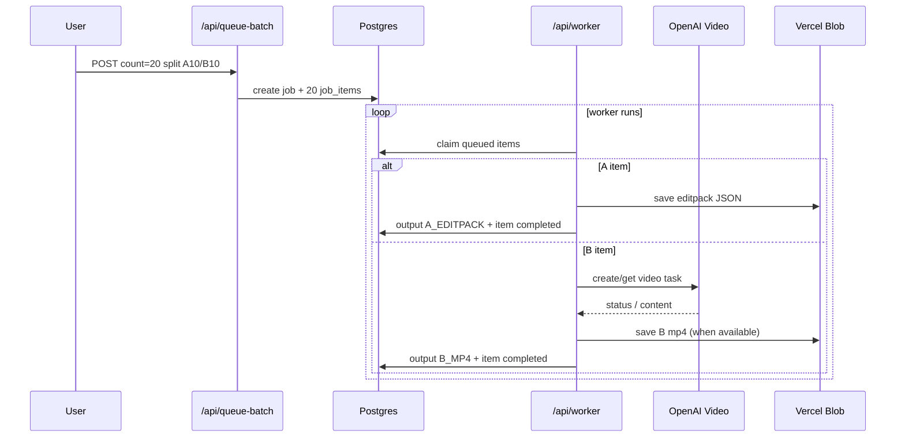
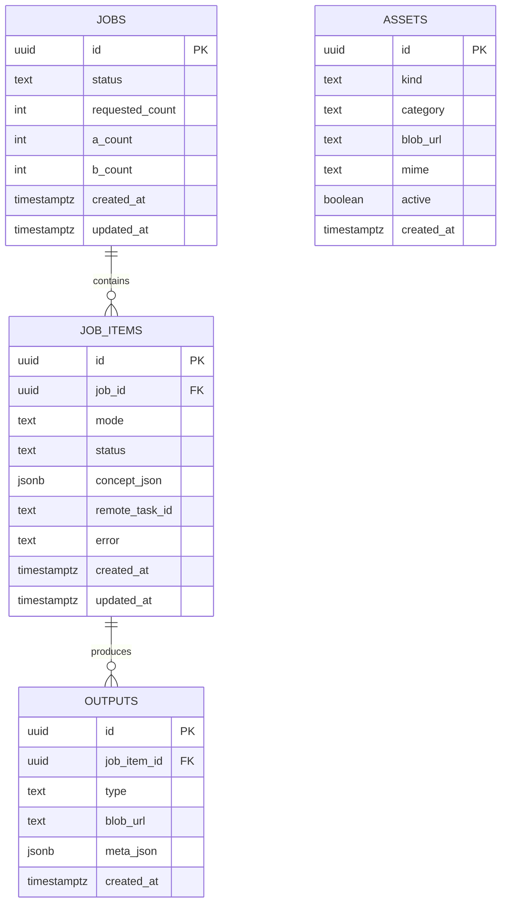

# Viral Machine MVP

A production-deployed MVP for batch-generating short-form content outputs:
- `A mode`: editpack JSON outputs (always available)
- `B mode`: MP4 outputs via OpenAI Video API
- Optional `A mp4` render path (currently disabled by default)
- Optional `A voiceover mp3` via ElevenLabs voice profiles
- Optional approval workflow per batch (`autonomous` vs `approval`)

Live app: `https://viral-machine-mvp.vercel.app`
Worker host (DigitalOcean): `http://104.131.127.207:8788`

---

## What This App Does

1. Queues a batch (`A10/B10` by default).
2. Processes items with worker APIs and cron.
3. Stores outputs and assets in Postgres + Vercel Blob.
4. Shows job results at `/jobs/<id>`.

### Core Surfaces

- Home: `/`
- Assets manager: `/assets`
- Job viewer: `/jobs/[id]`
- Voice studio: `/voices`
- Settings: `/settings`
- APIs:
  - `/api/init-db`
  - `/api/queue-batch`
  - `/api/worker`
  - `/api/render-worker`
  - `/api/jobs/[id]`
  - `/api/assets/upload`
  - `/api/assets/required`

---

## Architecture (Visual)

```mermaid
flowchart LR
  U[Admin User] --> H[/Home UI/]
  U --> A[/Assets UI/]
  H --> QB[/api/queue-batch]
  QB --> DB[(Postgres)]

  W1[/api/worker/] --> DB
  W1 --> OV[lib/openaiVideo.ts]
  OV --> OAI[(OpenAI Video API)]
  W1 --> BL[(Vercel Blob)]

  W2[/api/render-worker/] --> DB
  W2 --> BL

  J[/jobs/:id/] --> JAPI[/api/jobs/:id]
  JAPI --> DB
```

### Batch Lifecycle



### Data Model Snapshot



---

## Quick Start (Local)

```bash
npm install
cp .env.example .env.local
npm run dev
```

Initialize DB:

```bash
curl http://localhost:3000/api/init-db
```

Expected:

```json
{"ok":true}
```

## Deep YouTube Analysis (Local Machine)

Use this when you want real style breakdown from actual video frames (animation vs slideshow vs talking-head, pacing, etc.).

```bash
npm run dev:deep
```

What this does:
- verifies `ffmpeg` and `yt-dlp` are installed (and attempts brew install if missing)
- checks `.env.local` + `OPENAI_API_KEY`
- starts the app in dev mode

Tool check only:

```bash
npm run check:deep-tools
```

---

## Environment Variables

Required for production:

- `POSTGRES_URL`
- `BLOB_READ_WRITE_TOKEN`
- `OPENAI_API_KEY`
- `GEMINI_API_KEY` (required only when using Gemini/Veo provider)
- `NEXT_PUBLIC_SITE_URL`
- `ADMIN_PASSWORD`
- `WORKER_BASE_URL` (DigitalOcean worker base URL)
- `WORKER_API_KEY` (shared secret for app -> worker calls)

Optional:

- `OPENAI_VIDEO_MODEL` (default `sora-2`)
- `GEMINI_VIDEO_MODEL` (default `veo-3.1-fast-generate-preview`)
- `VIDEO_PROVIDER` (`openai` | `gemini` | `auto`, default `openai`)
- `RENDER_A_ENABLED` (default `false`)
- `ELEVENLABS_API_KEY`
- `ELEVENLABS_DEFAULT_MODEL` (default `eleven_multilingual_v2`)

---

## Deploy + Runbook

```bash
vercel
vercel deploy --prod
```

Then:

1. Open `/api/init-db` and verify `{"ok":true}`.
2. Set env vars in Vercel (if not already set).
3. Upload minimum assets at `/assets`.
4. Queue a batch on `/`.
5. Trigger workers:
   - `/api/worker`
   - `/api/render-worker`
6. Review outputs at `/jobs/<id>`.

### Non-Technical Operating Flow

1. Open `/` and paste a YouTube link (optional, but recommended).
2. Click `Deep Analyze Video Style` to save style context.
3. Open `/assets` and upload the starter asset pack.
4. Return to `/` and click `Generate 20 + Queue A10/B10`.
5. On the same page, click `Run Both` if jobs stay queued.
6. Open `/jobs/<id>` and watch for:
   - `A editpack` JSON links
   - `B mp4` links
   - optional `A mp4` links when rendering is enabled

### DigitalOcean Worker Notes

- Vercel route `/api/reference/deep-analyze` forwards to the external worker when `WORKER_BASE_URL` is set.
- Worker service lives in `worker-service/` and requires:
  - `OPENAI_API_KEY`
  - `WORKER_API_KEY`
- Health check endpoint: `GET /health`
- Main endpoint: `POST /deep-analyze`

---

## Required Minimum Asset Categories

- `broll/aroll_facecam`
- `broll/receipts_desk`
- `broll/laptop_dashboard_generic`
- `broll/airport_lifestyle`
- `proof/points_screenshot_generic`
- `music/bed`

---

## Project Layout

```text
app/
  api/
  assets/
  jobs/[id]/
components/
lib/
  openaiVideo.ts
  workers.ts
  db.ts
db/
  schema.sql
types/
```

---

## Known Operational Notes

- B-mode generation depends on async polling behavior from OpenAI Video jobs.
- A-mode MP4 rendering is currently off unless `RENDER_A_ENABLED=true`.
- Worker endpoints are safe to trigger manually if cron is delayed.

---

## Next Build Ideas

- Trend ingestion + pattern extraction
- OpenAI-generated concept strategy (instead of deterministic templates)
- Dedicated rendering service outside Vercel for heavier A-MP4 jobs
